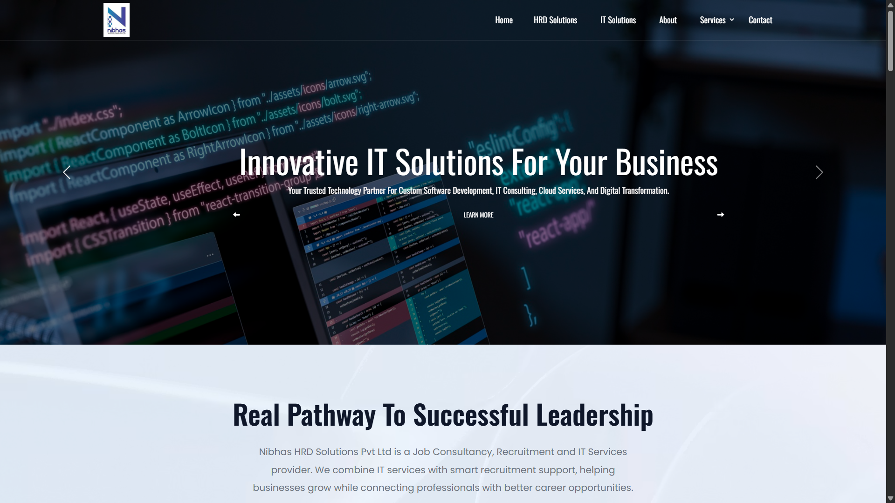
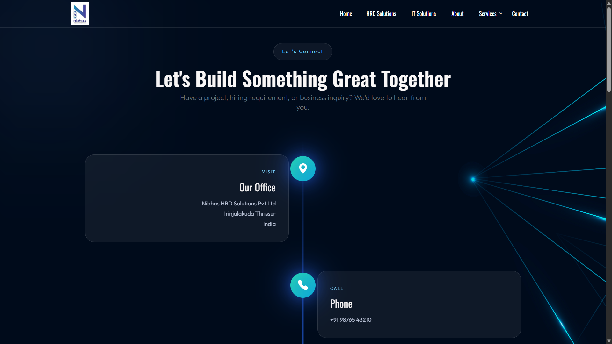

<div align="center">

# 🌐 Nibhas HRD Solutions Pvt. Ltd.

### Empowering Businesses Through **Technology** & **Human Resource Excellence**

A modern, responsive corporate website built to showcase the IT and HRD services of **Nibhas HRD Solutions Pvt. Ltd.**

<p>


</p>

</div>

---

# 📖 About The Project

Nibhas HRD Solutions Pvt. Ltd. is a company specializing in both **Information Technology Services** and **Human Resource Development**.

This website was designed and developed to present the company's services with a modern, responsive, and engaging user experience.

The project combines elegant UI design, smooth animations, interactive sections, and professional branding suitable for a corporate business website.

---

# ✨ Key Features

- 🎨 Modern Corporate UI Design
- 📱 Fully Responsive Layout
- 💻 IT Solutions Showcase
- 👨‍⚕️ HRD Solutions Showcase
- 🌐 Web Development Services
- 🖥 Software Development Services
- 📈 Digital Marketing
- 🏥 Healthcare Recruitment
- 🧑‍💼 Doctor Placement Services
- 🎥 Background Video Sections
- ⚡ Smooth Scroll Animations
- 🖼 Portfolio / Latest Work
- 📞 Contact Page
- 📍 Google Maps Integration Ready
- 🔗 Social Media Integration

---

# 🛠 Tech Stack

| Frontend | Libraries |
|----------|-----------|
| HTML5 | Bootstrap 5 |
| CSS3 | Bootstrap Icons |
| JavaScript | WOW.js |
| Responsive Design | Animate.css |

---

# 📂 Project Structure

```text
NibhasWebsite/

├── assets/
│
├── css/
│
├── js/
│
├── img/
│
├── icon/
│
├── video/
│
└── fonts/

├── index.html
├── nibhashrdsolutions.html
├── services.html
├── contact.html
├── about.html
└── README.md
```

---

# 🚀 Pages Included

✅ Home

✅ About Us

✅ IT Solutions

✅ HRD Solutions

✅ Services

✅ Latest Work

✅ Contact

---

# 🎯 Services

### 💻 IT Solutions

- Website Development
- Software Development
- ERP Solutions
- UI / UX Design
- Digital Marketing
- Website Maintenance
- Cloud Solutions

### 👨‍💼 HRD Solutions

- Healthcare Recruitment
- Doctor Placement
- HR Consulting
- Corporate Staffing
- Talent Acquisition
- Training & Development

---

# 📱 Responsive Design

Optimized for:

- 💻 Desktop
- 💼 Laptop
- 📱 Mobile
- 📟 Tablet

---

# ⚡ Performance Features

- Optimized Images
- Lightweight Design
- Responsive Grid
- Smooth Animations
- Modern Typography
- SEO Friendly Structure

---

# 📸 Screenshots

Create a folder:

```text
assets/screenshots/
```

Example:

```markdown
## Home



## Services


## Contact


```

---

# 🚀 Installation

Clone the repository

```bash
git clone https://github.com/YOUR_USERNAME/NibhasWebsite.git
```

Move into the project

```bash
cd NibhasWebsite
```

Open with VS Code

```bash
code .
```

Run using **Live Server**.

---

# 🌍 Live Demo

Replace with your deployment URL after publishing.

```text
https://YOUR_USERNAME.github.io/NibhasWebsite/
```

---

# 📌 Future Improvements

- Admin Dashboard
- Job Application Portal
- Online Recruitment System
- Appointment Booking
- CMS Integration
- AI Chatbot
- Dark Mode
- Blog Section
- Multi-language Support

---

# 👨‍💻 Developer

## Arjun Krishna T S

**Python Developer | Django Developer | Frontend Developer**

### Skills

- Python
- Django
- HTML
- CSS
- JavaScript
- Bootstrap
- MySQL
- Git & GitHub

---

# 🤝 Connect With Me

GitHub

```
https://github.com/YOUR_USERNAME
```

LinkedIn

```
https://linkedin.com/in/YOUR_USERNAME
```

Portfolio

```
https://YOUR_WEBSITE
```

---

# ⭐ Support

If you like this project,

⭐ Star this repository

🍴 Fork it

🛠 Contribute

---

<div align="center">

## Made with ❤️ by Arjun Krishna T S

</div>
